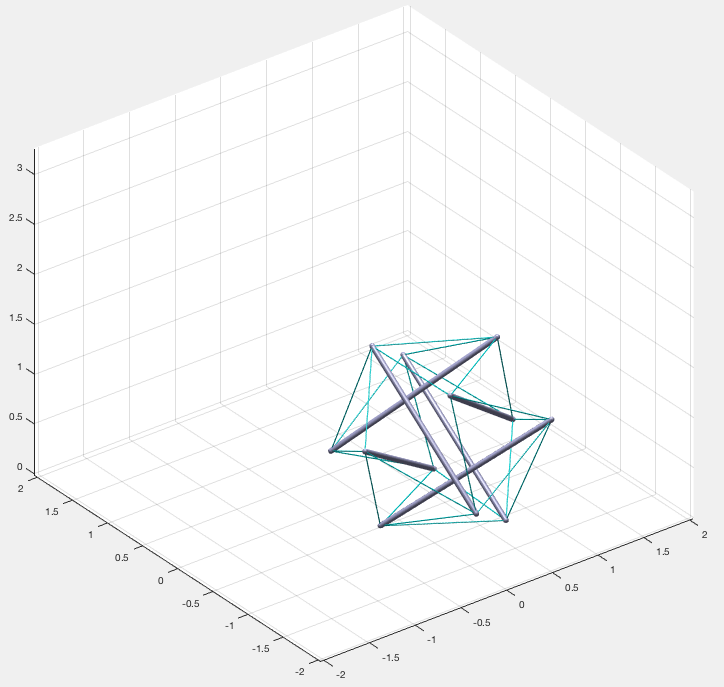

#Getting-Started Tutorial
This short tutorial shows how to create a tensegrity model and simulate its dynamics using the Tensegrity_MATLAB_Objects framework. To see the end result of the tutorial, run  `./simpleDynamicsExample/firstSixBarExample.m`.


## File Organization
Each simulation project consists of a main `.m` script file, and an auxiliary dynamics update function. To create a new project, create a new folder in `Tensegrity_MATLAB_Objects` with your simulation name. Then, create a new MATLAB script `example.m`.

## `TensegrityStructure` Class
To create a representation of an arbitrary tensegrity in the simulator, make an instance of the `TensegrityStructure` class. First, make sure to include the "tensegrityObjects" folder
```MATLAB
% NOTE: *nix systems use '/', while Windows systems use '\' for filepaths.
addpath('../tensegrityObjects')
```
Then, create a *n*-by-3 matrix of node positions, where *n* is the number of nodes in the tensegrity. In this case, the tensegrity has 12 nodes.
```MATLAB
nodes = [-barSpacing     barLength*0.5  0;
         -barSpacing    -barLength*0.5  0;
          barSpacing     barLength*0.5  0;
          barSpacing    -barLength*0.5  0;
          0             -barSpacing     barLength*0.5;
          0             -barSpacing    -barLength*0.5;
          0              barSpacing     barLength*0.5;
          0              barSpacing    -barLength*0.5;        
          barLength*0.5  0             -barSpacing;
         -barLength*0.5  0             -barSpacing;
          barLength*0.5  0              barSpacing;
         -barLength*0.5  0              barSpacing];
```
In order to move the tensegrity to a certain position or rotate it, simply move/rotate the nodal coordinates:
```MATLAB
HH  = makehgtform('axisrotate',[1 1 0],0.3); % Rotate 
nodes = (HH(1:3,1:3)*nodes')';
nodes(:,3) = nodes(:,3) + 1*barLength; % Move above ground level
```
Create simplified bar- and string-connectivity matrices, to tell the simulator how the nodes are connected with bars and strings. Each simplified connectivity matrix is 2-by-*n*, where *n* is the number of bars/strings. For example, this means nodes 1 and 7 are connected by a string.
```MATLAB
bars = [1:2:11; 
        2:2:12];
strings = [1  1   1  1  2  2  2  2  3  3  3  3  4  4  4  4  5  5  6  6  7  7  8  8;
           7  8  10 12  5  6 10 12  7  8  9 11  5  6  9 11 11 12  9 10 11 12  9 10];
```
Also, create a vector of string spring rest lengths to represent the initial state of prestress of the tensegrity:
```MATLAB
stringRestLength = 0.9*ones(24,1)*norm(nodes(1,:)-nodes(7,:));
```
We also need to define some physical properties of our system as well as the simulation physics timestep (note this is different from the display timestep).
```MATLAB
stringStiffness = K*ones(24,1);
barStiffness = 100000*ones(6,1);
stringDamping = c*ones(24,1);  %string damping vector
nodalMass = 1.625*ones(12,1);
delT = 0.001; % Set the physics simulation timestep (s).
```
Now, we are ready to create a `TensegrityStructure` object:
```MATLAB
superBall = TensegrityStructure(nodes, strings, bars, zeros(12,3), stringStiffness,...
    barStiffness, stringDamping, nodalMass, delT, delT, stringRestLength);
```
## TensegrityPlot
In order to visualize the `TensegrityStructure` we have created, use the `TensegrityPlot` class as follows. First, create a `TensegrityPlot` object and a figure. Then, generate and update the plot. You can adjust the radius of the bars and strings as desired.
```MATLAB
bar_radius = 0.025; % meters
string_radius = 0.005;
superBallDynamicsPlot = TensegrityPlot(nodes, strings, bars, bar_radius, string_radius);
f = figure('units','normalized','outerposition',[0 0 1 1]);
generatePlot(superBallDynamicsPlot, gca);
updatePlot(superBallDynamicsPlot);
```
After running this code, a plot should appear of the tensegrity. It is a 3D plot, so you may drag and rotate around in 3D space.

## Dynamics Update
Now we have created and visualized a tensegrity, let's simulate its dynamics. To do this, create a `myDynamicsUpdate` function in your project folder. This function will call `TensegrityStructure.dynamicsUpdate(...)` to update dynamics for a *display interval* time interval, which is usually longer than the *physics* timestep. Then, we update the nodes of the tensegrity in the `TensegrityPlot` object and draw them.
```MATLAB
function myDynamicsUpdate(tensStruct1, dynamicsPlot1, displayTimeInterval)
% This function will perform dynamics update each timestep.

%create some persistent variables for objects and structs
persistent tensStruct dynamicsPlot tspan

if nargin>1
    tensStruct = tensStruct1;
    dynamicsPlot = dynamicsPlot1;
    tspan = displayTimeInterval;
end

% Update nodes:
dynamicsUpdate(tensStruct, tspan);
dynamicsPlot.nodePoints = tensStruct.ySim(1:end/2,:);
updatePlot(dynamicsPlot);

drawnow  %plot it up
end
```
Now that we have created a dynamics update function, add a loop in the main `example.m` script, to call the dynamics update for a certain number of display updates:
```MATLAB
displayTimespan = 0.05; % 20fps. Increase display time interval if system can't keep up.
myDynamicsUpdate(superBall, superBallDynamicsPlot, displayTimespan);

for i = 1:200
    myDynamicsUpdate();
end
```
Now, you should be able to run the `example.m` script, and watch the tensegrity fall to the ground.
# Rest-Length Control Example
Control of the tensegrity structure may be implemented in the dynamics update auxiliary function. In our tutorial project `./simpleDynamicsExample/`, open the `myDynamicsUpdate` function and add the following lines:
```MATLAB
%%% Optional rest-length controller %%%
i = i + 1;
if i == 50 % Start after a certain time.
    newRestLengths = rand(24, 1); % Random rest lengths.
    tensStruct.simStruct.stringRestLengths = newRestLengths;
end

%%% End controller %%%
```
This code specifies a 'control input' of 24 rest lengths for each string on the tensegrity. Then, the rest lengths are set to the `TensegrityStructure` a single time in the simulation. You should see the tensegrity respond to the step input of the control lengths in the vizualization window.
# More Complex Examples
See UKF example `./superBallExample/`.

##### Tutorial Contributors
Alex Popescu